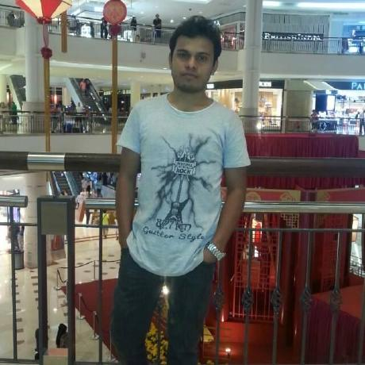

<!--Markdown-->
Hi, I'm yelias ahmed.  
I'm trying to write next line <!--Double space is used for next line-->
# Bangladesh
## I love my country
### I love my city where I born
#### I love my village where I grew up
##### I love my street where I spent my childhood
###### I Love my family who are my relative

<p>I love my mother, father, brothers and sisters more than my life</p>

_Italic Writing format at md_  
__Strong or bold writing format at md__  
~~This is strike through using tilda~~

`This is inline code blocks structure`
```
multiline code blocks structure
```

```html
<html>
    <head></head>
    <body></body>
</html>
```
```java
System.out.println("Hello multiline");
```
```js
console.log('hi, im js')
```

### Orderd list syntax:

1. Java 
   1. java basics
   2. OOP
2. Html
3. Selenium 
   1. java selenium
   2. python selenium

### Unorderd list syntax:

- Java 
   - java basics
   - OOP

### Task list syntax:

- [x] Task example1
- [x] Task 2

### Automatic link
  https://github.com/YeliasAhmed  
  https://www.facebook.com

### Disable link
`https://www.facebook.com`

### Markdown link syntax:

[title](Url)

### Markdown link
[Github](https://www.github.com/YeliasAhmed)


### All link is here  
[LinkedIn](linkedin)

### Image Syntax:


### Image Included:


<!--  -->

<br>

### Table syntax:


[linkedin]:https://www.linkedin.com/in/yelias-ahmed